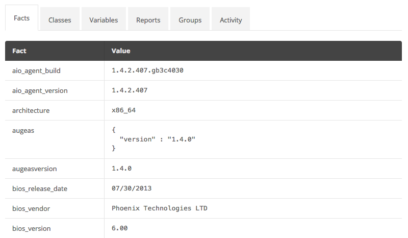

Each node in a PE deployment has its own node details page in the PE console. This is where you can view details specific to an individual node, such as the node facts. To view the node-specific information, in **Nodes**, click **Inventory** and then click the specific node that you would like to view.

> **Note:** To export a list of all of the nodes being managed by Puppet to a CSV file, click **Export data** at the top right of the **Inventory** page.

## Viewing node facts

The **Facts** tab contains all of the fact values reported by the node on its most recent run. Facts include things like the operating system (`operatingsystem`), the amount of memory (`memorytotal`), and the primary IP address (`ipaddress`). You can also [add custom facts]({{facter}}/custom_facts.html) to your Puppet modules, and they too will show up in the inventory.

## Viewing classes

The **Classes** tab shows the classes that have been assigned to the node. These classes have been assigned because the node matches the rules set in a node group containing the classes, or because the node was pinned to a node group containing the classes. **Source Group** shows the node group through which the class was applied.

## Viewing variables

The **Variables** tab shows a list of variables that have been applied to the node. These variables have been applied to the node because they have been set for node groups that the node currently matches. **Source Group** shows the node group in which the variable is set.

## Viewing node reports

When nodes fetch their configurations from the Puppet master, they send back a report of their Puppet run. The **Reports** tab shows a list of reports for the node, where each report represents a single Puppet run.

### Understanding the resource sync state

During a Puppet run, Puppet compares the _current state_ of each resource to the _desired state_ for that resource. If Puppet successfully compares them and the resource is already in sync (the current state is the desired state), Puppet moves on to the next resource without changing anything. Otherwise, it will attempt to modify the resource. The change to resources on each Puppet run is summarized in the columns that are displayed in the **Reports** tab.

* **Correction applied:** Number of resources that received a corrective change after Puppet identified resources that were out of sync with the applied catalog.
* **Failed:** Number of resources that failed.
* **Changed:** Number of resources that changed.
* **Unchanged:** Number of resources that remained unchanged.
* **No-op:** Number of resources that would have been changed if not run in no-op mode.
* **Skipped:** Number of resources that were skipped because they depended on resources that failed.
* **Failed restarts:** Number of resources that were supposed to restart but didn’t. For example, if changes to one resource notify another resource to restart, and that resource doesn’t restart, a failed restart is reported. It’s an indirect failure that occurred in a resource that was otherwise unchanged.

The reports table also offers the following information:

* **No-op mode:** An indicator of whether the node was run in no-op mode.
* **Config retrieval:** Time spent retrieving the catalog for the node (in seconds).
* **Run time:** Time spent applying the catalog on the node (in seconds).

Clicking a report in the **Reports** tab takes you to **Configuration Management** where you can view more detailed information about the Puppet run.

### Exporting node reports

To export a list of node reports to a CSV file, click **Export data** at the top right of the reports table. This will export all reports for the given node that have not yet expired.

To configure the reports expiration time, see the [PuppetDB documentation]({{puppetdb}}/configure.html#report-ttl). The default expiration is 14 days.

## Viewing node groups

The **Groups** tab shows a list of groups that the node currently matches. The node matches a group when it matches a rule that has been specified in that group.

The **Parent group** column shows the parent of the group listed in the **Group** column. A group inherits classification data from all ancestor groups. For more information on inheritance, see [How Does Inheritance Work?](./console_classes_groups_inheritance.html)

**Tip**: You can use the [group children](./nc_groups_children.html) endpoint to review group lineage.

The **Environment** column shows the environment that has been selected for the group. This doesn't necessarily indicate the environment that the node is in. Rather, it is the environment that is used to control which classes are available for selection in that group. In most cases, the environment that has been set for the node group should be the same as the environment that the matching nodes are in. This column is a good place to confirm that you have set the correct environments. To learn more about working with environments in the console, see the [grouping and classifying nodes](./console_classes_groups.html) documentation.

