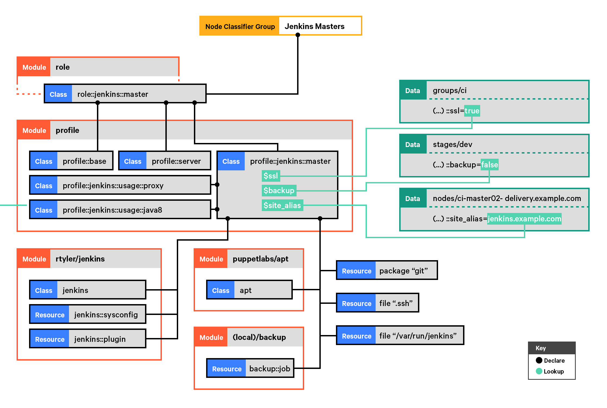

[intro]: ./r_n_p_intro.html
[example]: ./r_n_p_full_example.html
[profiles]: ./r_n_p_profiles.html
[roles]: ./r_n_p_roles.html

[main manifest]: {{puppet}}/dirs_manifest.html

Your typical goal with Puppet is to build _complete system configurations,_ which manage all of the software, services, and configuration that you care about on a given system.

Building system configurations can be challenging --- mostly because the systems you manage are complicated. To keep that complexity under control, your code needs to be reusable, easy to configure, and easy to refactor.

The **roles and profiles** method is the most reliable way to build reusable, configurable, and refactorable system configurations. It's not a straightforward recipe: you must think hard about the nature of your infrastructure and your team. It's also not a final state: expect to refine your configurations over time. Instead, it's an approach to _designing your infrastructure's interface_ --- sealing away incidental complexity, surfacing the significant complexity, and making sure your data behaves predictably.

## A summary of the roles and profiles method

Roles and profiles are **two extra layers of indirection** between your node classifier and your component modules. This separates your code into three levels:

* **Component modules:** Normal modules that manage one particular technology. (For example, puppetlabs/apache.)
* **Profiles:** Wrapper classes that use multiple component modules to configure a layered technology stack.
* **Roles:** Wrapper classes that use multiple profiles to build a complete system configuration.

These extra layers of indirection might seem like they add complexity, but they give you a space to build practical, business-specific interfaces to the configuration you care most about. A better interface makes hierarchical data easier to use, makes system configurations easier to read, and makes refactoring easier.



In short, from top to bottom:

* Your node classifier assigns one **role** class to a group of nodes. The role manages a whole system configuration, so no other classes are needed. The NC does not configure the role in any way.
* That role class declares some **profile** classes with `include`, and does nothing else. For example:

  ``` puppet
  class role::jenkins::master {
    include profile::base
    include profile::server
    include profile::jenkins::master
  }
  ```

* Each profile configures a layered technology stack, using multiple component modules and the built-in resource types. (In the diagram, `profile::jenkins::master` uses rtyler/jenkins, puppetlabs/apt, a home-built backup module, and some `package` and `file` resources.)
* Profiles can take configuration data from Hiera. (In the diagram, three different hierarchy levels contribute data.)
* Classes from component modules are always declared via a profile, and never assigned directly to a node.
    * If a component class has parameters, you specify them in the _profile;_ never use Hiera to override component class params.

## Building configurations without roles and profiles

Without roles and profiles, people typically build system configurations in their node classifier or [main manifest][], using Hiera to handle tricky inheritance problems. A standard approach is to create a group of similar nodes and assign classes to it, then create child groups with extra classes for nodes that have additional needs. Another common pattern is to put everything in Hiera, using a very large hierarchy that reflects every variation in the infrastructure.

If this works for you, then it works! You might not need roles and profiles. But most people find direct building gets difficult to understand and maintain over time.

## Next steps

Now that you understand what the roles and profiles method is, you can learn how to use it with [a simple (but not oversimplified) example workflow.][example]
