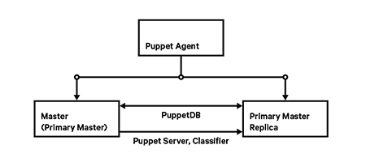
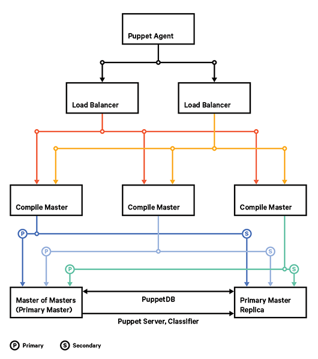

# High availability

High availability configuration creates a replica of your primary master.

The primary master is your Puppet master or, if your installation includes compile masters, your master of masters. The replica node is called the primary master replica. You may only have one provisioned replica at a time.

**Note:** We don’t support high availability for split installations — where the master, console, and PuppetDB components are installed on separate machines. Only monolithic installations — with or without compile masters and a master of masters — are supported.

There are two main advantages to enabling high availability:

-   If your primary master fails, the replica takes over, continuing to perform critical operations.

-   If your primary master can’t be repaired, you can promote the replica to master. Promotion establishes the replica as the new, permanent master.

**Related topics**  

[What happens during failovers](high_availability_overview.md#)

## High availability architecture

The primary master replica is not an exact copy of the primary master. Rather, the replica duplicates specific infrastructure components and services. Hiera data and other custom configurations are not replicated.

Replication may be read-write, meaning that data can be written to the service or component on either the master or the replica, and the data is synced to both nodes. Alternatively, replication may be read-only, where data is written only to the master and synced to the replica. Some components and services, like Puppet Server and the console service UI, are not replicated because they contain no native data.

Some components and services are activated immediately when you enable a replica; others aren't active until you promote a replica. After you provision and enable a replica, it serves as a compile master, redirecting PuppetDB and cert requests to the primary master.

|Component or service|Type of replication|Activated when replica is...|
|--------------------|-------------------|----------------------------|
|Puppet Server|none|enabled|
|File sync client|read-only|enabled|
|PuppetDB|read-write|enabled|
|Certificate authority|read-only|promoted|
|RBAC service|read-only|enabled|
|Node classifier service|read-only|enabled|
|Activity service|read-only|enabled|
|Orchestration service|read-only|promoted|
|Console service UI|none|promoted|

In a monolithic installation, when a Puppet run fails over, agents communicate with the replica instead of the master.

In a monolithic installation with compile masters, agents communicate with load balancers or compile masters, which communicate with the master or replica.

## What happens during failovers

Failover occurs when the replica takes over services usually performed by the master.

Failover is automatic — you don’t have to take action to activate the replica. With high availability enabled, Puppet runs are directed first to the master. If the primary master is either fully or partially unreachable, runs are directed to the replica.

In partial failovers, Puppet runs may use the server, node classifier, or PuppetDB on the replica if those services aren’t reachable on the master. For example, if the master’s node classifier fails, but its Puppet Server is still running, agent runs use the Puppet Server on the master but fail over to the replica’s node classifier.

What works during failovers:

-   Scheduled Puppet runs
-   Catalog compilation
-   Viewing classification data using the node classifier API
-   Reporting and queries based on PuppetDB data

What doesn’t work during failovers:

-   Deploying new Puppet code
-   Editing node classifier data
-   Using the console
-   Certificate functionality, including provisioning new agents, revoking certificates, or running the `puppet certificate` command
-   Most CLI tools
-   Application orchestration

## System and software requirements

Your Puppet infrastructure must meet specific requirements in order to configure high availability.

|Component|Requirement|
|---------|-----------|
|Operating system|All supported PE master platforms.|
|Software|-   You must use Code Manager so that code is deployed to both the master and the replica after you enable a replica.
-   You must use the default PE node classifier so that high availability classification can be applied to nodes.

-   Orchestrator must be enabled so that agents are updated when you provision or enable a replica. Orchestrator is enabled by default.

|
|Replica|-   Must be an agent node that doesn’t have a specific function already. For example, you can’t provision an existing master or compile master as a replica.
-   Must have the same hardware specifications and capabilities as your primary master node.

|
|Firewall|Both the master and the replica must comply with these port requirements: -   Firewall configuration for monolithic installations with compile masters. These requirements apply whether your HA environment uses a single master or compile masters.
-   Port 5432 must be open to facilitate database replication by console services.

|
|Node names|-   You must use resolvable domain names when specifying node names for the master and replica.

|
|RBAC tokens|-   You must have an admin RBAC token when running `puppet infrastructure` commands, including `provision`, `enable`, and `forget`. You can generate a token using the `puppet-access` command.

**Note:** You don’t need an RBAC token to promote a replica.

|

**Related topics**  

[Managing and deploying Puppet code](managing_puppet_code.md)

[Orchestrating Puppet and tasks](orchestrating_puppet_and_tasks.md)

[Firewall configuration for monolithic installations with compile masters](system_configuration.md#)

[Generate a token using puppet-access](rbac_token_auth_intro.md#)

## Classification changes in high availability installations

When you provision and enable a replica, the system makes a number of classification changes in order to manage high availability without affecting existing configuration.

These preconfigured node groups are added in high availability installations:

|Node group|Matching nodes|Inherits from|
|----------|--------------|-------------|
|**PE HA Master**|primary master|**PE Master** node group|
|**PE HA Replica**|primary master replicas|**PE Infrastructure** node group|

These parameters are used to configure high availability installations:

|Parameter|Purpose|Node group|Classes|Notes|
|---------|-------|----------|-------|-----|
|`agent-server-urls`|Specifies the list of servers that agents contact, in order.|**PE Agent**

 **PE Infrastructure Agent**

|`puppet_enterprise:: profile::agent`|In monolithic installations with compile masters, agents must be configured to communicate with the load balancers or compile masters.

**Important:** Setting agents to communicate directly with the replica in order to use the replica as a compile master is not a supported configuration.

|
|`replication_mode`|Sets replication type and direction on masters and replicas.|**PE Master** \(`none`\)

 **HA Master** \(`source`\)

 **HA Replica**\(`replica`\)

|`puppet_enterprise:: profile::master``puppet_enterprise:: profile::database` `puppet_enterprise:: profile::console`|System parameter. Don’t modify.|
|`ha_enabled_replicas`|Tracks replica nodes that are failover ready.|**PE Infrastructure**|`puppet_enterprise`|System parameter. Don't modify.

 Updated when you enable a replica.

|
|`pcp_broker_list`|Specifies the list of Puppet Communications Protocol brokers that Puppet Execution Protocol agents contact, in order.|**PE Agent**

 **PE Infrastructure Agent**

|`puppet_enterprise:: profile::agent`| |

## Load balancer timeout in high availability installations

High availability configuration uses timeouts to determine when to fail over to the replica. If the load balancer timeout is shorter than the server and agent timeout, connections from agents might be terminated during failover.

To avoid timeouts, set the timeout option for load balancers to four minutes or longer. This duration allows compile masters enough time for required queries to PuppetDB and the node classifier service. You can set the load balancer timeout option using parameters in the haproxy or f5 modules.

