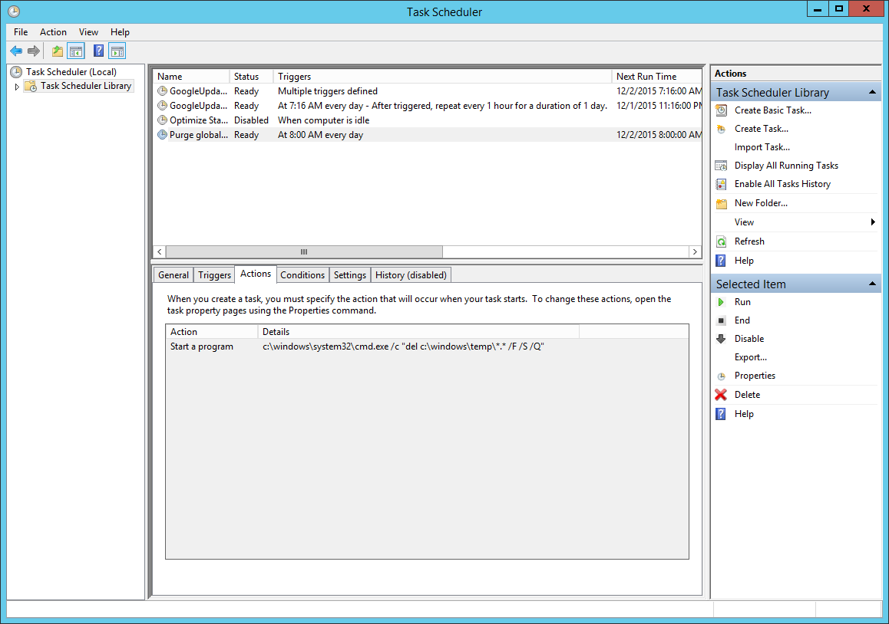
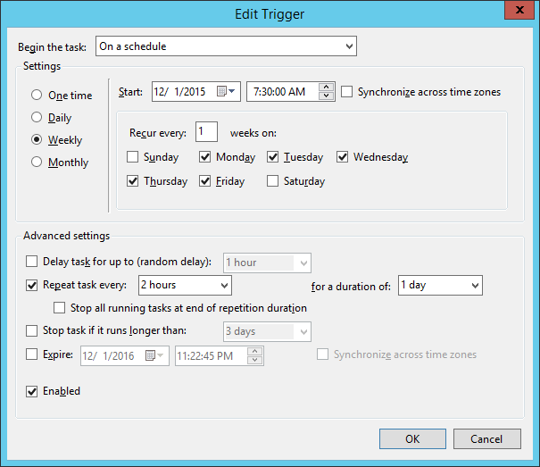
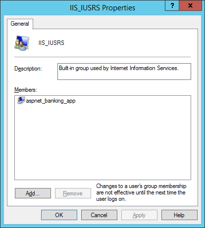
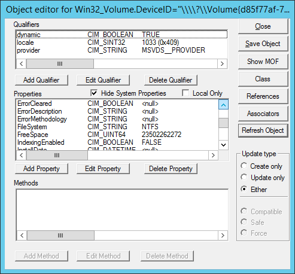

# Managing Windows configurations

This page covers the different ways you can use Puppet to manage your windows configurations, including creating local group and user accounts.

**Related information**  


[Basic tasks and concepts in Windows](basic_tasks_and_concepts_in_windows.md#)

[Installing and using Windows modules](installing_and_using_windows_modules.md#)

## Manage Windows services

You can use Puppet to manage Windows services, specifically, to start, stop, enable, disable, list, query, and configure services. This way, you can ensure that certain services are always running or are disabled as necessary.

### About this task

You write Puppet code to manage services in the manifest. When you apply the manifest, the changes you make to the service are applied.

**Note:** In addition to using manifests to apply configuration changes, you can query system state using the `puppet resource` command, which emits code as well as applying changes.

### Ensure a Windows service is running

There are often services that you always want running in your infrastructure.

#### Procedure

1.  To have Puppet ensure that a service is running, use the following code:

    ```
    service { '<service name>':
           ensure => 'running'
        }
    ```


#### Example

For example, the following manifest code ensures the  Windows Time service is running:

```
service { 'w32time':
  ensure => 'running'
}
```

### Stop a Windows service

Some services can impair performance, or may need to be stopped for regular maintenance.

#### Procedure

1.  To disable a service, use the code:

    ```
    service { '<service name>':
       ensure => 'stopped',
       enable => 'false'
    }
    ```


#### Example

For example, this disables the disk defragmentation service, which can negatively impact service performance.

```
 service { 'defragsvc':
  ensure => 'stopped',
  enable => 'false'
}
```

### Schedule a recurring task

Regularly scheduled tasks are often necessary on Windows to perform routine system maintenance.

#### About this task

If you need to sync files from another system on the network, perform backups to another disk, or execute log or index maintenance on SQL Server, you can use Puppet to schedule and perform regular tasks. The following shows how to regularly delete files.

#### Procedure

1.  To delete all files recursively from `C:\Windows\Temp` at 8 AM each day, create a resource called `scheduled_task` with these attributes:

    ```
    scheduled_task { 'Purge global temp files':
       ensure    => present,
       enabled   => true,
       command   => 'c:\\windows\\system32\\cmd.exe',
       arguments => '/c "del c:\\windows\\temp\\*.* /F /S /Q"',
       trigger   => {
          schedule   => daily,
          start_time => '08:00',
      }
    }
    ```


#### Results

After you set up Puppet to manage this task, the Task Scheduler includes the task you specified:



#### Example

In addition to creating a trivial daily task at a specified time, the scheduled task resource supports a number of other more advanced scheduling capabilities, including more fine-tuned scheduling. For example, to change the above task to instead perform a disk clean-up every 2 hours, modify the trigger definition:

```
scheduled_task { 'Purge global temp files every 2 hours':
   ensure  => present,
   enabled => true,
   command   => 'c:\\windows\\system32\\cmd.exe',
   arguments => '/c "del c:\\windows\\temp\\*.* /F /S /Q"',
   trigger => [{
      day_of_week => ['mon', 'tues', 'wed', 'thurs', 'fri'],
      every => '1',
      minutes_interval => '120',
      minutes_duration => '1440',
      schedule => 'weekly',
      start_time => '07:30'
   }],
  user => 'system',
}
```

You can see the corresponding definition reflected in the Task Scheduler GUI:



More information and the [scheduled\_task module](https://forge.puppet.com/puppetlabs/scheduled_task) are available in the Forge.

-   
## Manage Windows users and groups

Puppet can be used to create local group and user accounts. Local user accounts are often desirable for isolating applications requiring unique permissions.

### Manage administrator accounts

It is often necessary to standardize the local Windows Administrator password across an entire Windows deployment.

#### Procedure

1.  To manage administrator accounts with Puppet, create a user resource with `'Administrator'` as the resource title like so:

    ```
    user { 'Administrator':
       ensure => present,
       password => 'yabbadabba'
    }
    ```

    **Note:** Securing the password used in the manifest is beyond the scope of this introductory example, but it’s common to use Hiera, a key/value lookup tool for configuration, with eyaml to solve this problem. Not only does this solution provide secure storage for the password value, but it also provides parameterization to support reuse, opening the door to easy password rotation policies across an entire network of Windows machines.


#### Results

### Configure an app to use a different account

You might not always want to use the default user for an application, you can use Puppet to create users for other applications, like ASP.NET.

#### Procedure

1.  To configure ASP.NET apps to use accounts other than the default `Network Service`, create a user and exec resource: 

    ```
    user { 'aspnet_banking_app':
       ensure          => present,
       managehome      => true,
       comment         => 'ASP.NET Service account for Banking application',
       password        => 'banking_app_password',
       groups          => ['IIS_IUSRS', 'Users'],
       auth_membership => 'minimum',
       notify          => Exec['regiis_aspnet_banking_app']
    }
    
    exec { 'regiis_aspnet_banking_app':
       path        => 'c:\\windows\\Microsoft.NET\\Framework\\v4.0.30319',
       command     => 'aspnet_regiis.exe -ga aspnet_banking_app',
       refreshonly => true
    }
    ```


#### Results

In this example, the user is created in the appropriate groups, and the ASP.NET IIS registration command is run after the user is created to ensure file permissions are correct.



In the user resource, there are a few important details to note:

-   `managehome` is set to create the user's home directory on disk.

-   `auth_membership` is set to minimum, meaning that Puppet will make sure the `aspnet_banking_app` user is a part of the `IIS_IUSRS` and `Users` group, but will not remove the user from any other groups it might be a part of.

-   `notify` is set on the user, and `refreshonly` is set on the `exec`. This tells Puppet to run `aspnet_regiis.exe` only when the `aspnet_banking_app` is created or changed.


### Manage local groups

Local user accounts are often desirable for isolating applications requiring unique permissions. It can also be useful to manipulate existing local groups.

#### Procedure

1.  To add domain users or groups not present in the Domain Administrators group to the local Administrators group, use this code:

    ```
    group { 'Administrators':
       ensure  => 'present',
       members => ['DOMAIN\\User'],
       auth_membership => false
    }
    ```


#### Results

In this case, `auth_membership` is set to false to ensure that `DOMAIN\User` is present in the Administrators group, but that other accounts that might be present in Administrators are not removed.

Note that the `groups` attribute of `user` and the `members` attribute of `group` might both accept SID values, like the well-known SID for Administrators, S-1-5-32-544.

## Executing PowerShell code

Some Windows maintenance tasks require the use of Windows Management Instrumentation \(WMI\), and PowerShell is the most useful way to access WMI methods.

### About this task

Puppet has a PowerShell that can be used to execute arbitrary PowerShell code.

A common Windows maintenance tasks is to disable Windows drive indexing, because it can negatively impact disk performance on servers.

### Procedure

1.  To disable drive indexing:

    ```
    $drive = 'C:'
    
    exec { 'disable-c-indexing':
       provider  => powershell,
       command   => "\$wmi_volume = Get-WmiObject -Class Win32_Volume -Filter 'DriveLetter=\"${drive}\"'; if (\$wmi_volume.IndexingEnabled -ne \$True) { return }; \$wmi_volume | Set-WmiInstance -Arguments @{IndexingEnabled = \$False}",
       unless    => "if ((Get-WmiObject -Class Win32_Volume -Filter 'DriveLetter=\"${drive}\"').IndexingEnabled) { exit 1 }",
    }
    ```


### Results

You can see the results in your object editor window:



Using the Windows built-in WBEMTest tool, running this manifest sets `IndexingEnabled` to `FALSE`, which is the desired behavior.

This `exec` sets a few important attributes:

-   The provider is configured to use PowerShell \(which relies on the module\).

-   The command contains inline PowerShell, and as such, must be escaped with PowerShell variables preceded with `$` must be escaped as `\$`.

-   The `unless` attribute is set to ensure that Puppet behaves idempotently, a key aspect of using Puppet to manage resources. If the resource is already in the desired state, Puppet will note perform the command to modify the resource state. 


## Using templates to better manage Puppet code

While inline PowerShell is usable as an `exec` resource in your manifest, such code can be difficult to read and maintain, especially when it comes to handling escaping rules.

For executing multi-line scripts, use Puppet templates instead. The following example shows how you can use a template to organize the code for disabling Windows drive indexing.

```
$drive = 'C:'

exec { 'disable-c-indexing':
  command   => template('Disable-Indexing.ps1.erb'),
  provider  => powershell,
  unless    => "if ((Get-WmiObject -Class Win32_Volume -Filter 'DriveLetter=\"${drive}\"').IndexingEnabled) { exit 1 }",
}
```

The PowerShell code for Disable-Indexing.ps1.erb becomes:

```
function Disable-Indexing($Drive)
{
  $drive = Get-WmiObject -Class Win32_Volume -Filter "DriveLetter='$Letter'"
  if ($drive.IndexingEnabled -ne $True) { return }
  $drive | Set-WmiInstance -Arguments @{IndexingEnabled=$False} | Out-Null
}

Disable-Indexing -Drive '<%= @driveLetter %>'
```

## Example: Installing NSClient++ package

Running installers to setup software on Windows is another common task that Puppet excels at - and Puppet is able to handle installation of any MSI or EXE based package.

To monitor Windows hosts, NSClient++ is often installed to enable Windows servers to report metric data to a Nagios server. This code downloads and installs NSClient++ 0.4.4.15:

```
$file = 'NSCP-0.4.4.15-x64.msi'
$url  = "https://github.com/mickem/nscp/releases/download/0.4.4.15/${file}"
$temp = "C:\\Windows\\Temp\\${file}"

exec { 'download_nsclient':
  provider  => powershell,
  # note that Start-BitsTransfer can't handle redirected URLs
  command   => "(New-Object Net.WebClient).DownloadFile(\"${url}\", \"${temp}\")",
  creates   => $temp
}

package { 'NSClient++ (x64)':
  ensure  => '0.4.4.15',
  source  => $temp,
  notify  => Reboot['NSClient_install_reboot']
}

reboot { 'NSClient_install_reboot':
  when => refreshed
}
```

There are a number of important notes about this manifest:

-   Like the previous example, the PowerShell provider is set so that Puppet can call PowerShell to download the NSClient++ installer.
-   The `exec` uses the `creates` attribute to make sure Puppet only downloads and caches the installer once.
-   The package resource uses the package's exact version for the `ensure` value, and the resource name of NSClient++ \(x64\) must exactly match what the installer has specified. This allows Puppet to check Windows for installed applications and will prevent the NSClient++ installer from being run unnecessarily.
-   A manual reboot has been added after NSClient++ is installed, and it occurs only when Puppet has triggered the MSI installation. This is added to the example strictly for demonstration purposes, since software installs sometimes require reboots on Windows. If Puppet is instructed to reboot partway through an agent run, it will gracefully shut down, and resume where it left off after the reboot. Note that this requires that the reboot module be installed as well. More information and the [reboot module](https://forge.puppet.com/puppetlabs/reboot) are available in the Forge.

Under typical circumstances, installable packages are housed on a secure internal network and accessed through a Chocolatey feed or a local SMB share. For the sake of providing a simple, self-contained example, this manifest downloads the NSClient++ client and triggers the install afterwards.

