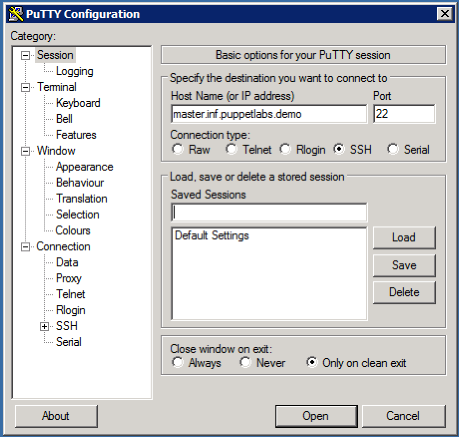
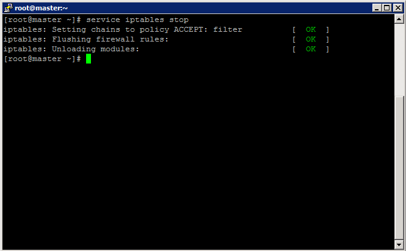

# Installing Puppet Enterprise for a Windows environment

Puppet masters can only run on \*nix machines, but Windows machines can run as Puppet agents.

**Related information**  

[Basic tasks and concepts in Windows](basic_tasks_and_concepts_in_windows.md#)

[Installing and using Windows modules](installing_and_using_windows_modules.md#)

[Troubleshooting Windows](troubleshooting_windows.md#)

## Install for a Windows environment 

This walkthrough shows you how to use a Windows machine to install a Puppet master on a Linux server and then install a Puppet agent on your Windows machine.

### Before you begin

To perform these steps, you'll need a Windows machine and a Linux server. The examples in this walkthrough use a Linux server running Red Hat Enterprise Linux \(RHEL\) 6.

Your Linux machine \(the Puppet master\) will need:

-   A designated hostname.
-   A fully qualified domain name \(FQDN\).
-   6GB of RAM and 4 cores. See PE hardware recommendations.
-   Accessibility over port 3000.
-   The ability to log in as the root user, or as a user who has sudo privileges.

### Prep your Windows system

Some extra software is necessary so you can communicate and work between your Windows and Linux machines. 

#### About this task

On your Windows machine:

#### Procedure

1.  If you don’t already have an SSH client installed, install one. This example uses Putty.

2.  If you don’t already have an SFTP client installed, install one. Popular clients include FileZilla and WinSCP.

### Install the master on your Linux machine

Before you can manage a machine running a Windows operating system, you must first install the master on a Linux server, because it cannot run on Windows.

#### Procedure

1.  On your Windows machine, download the master installer package for EL \(RHEL, CentOS, Scientific Linux, Oracle Linux\) version 6 from the Puppet Enterprise download page.

2.  On your Windows machine, using your SFTP client, copy the master installer package onto the Linux machine you’ve designated to be your master.

3.  On your Windows machine, using your SSH client, ssh into your Linux machine, and enter the hostname or IP address and port.

    

4.  When prompted in the terminal, log into your Linux machine as the `root` user.

5.  Your Linux machine should have a designated hostname. To verify the hostname, run ``hostname -f``

6.  To access the web-based installer used by PE, make sure port 3000 is accessible.

    This method depends on both the OS and cloud/virtualization platform you’re using.

    

7.  To extract the installer tarball, run `tar -xvf <TARBALL FILENAME>`

8.  Navigate into the installer directory by running `cd <INSTALLER DIRECTORY>`

9.  To start the installation script, run `./puppet-enterprise-installer`

10. Guided installation information will be displayed. When prompted, answer y to install the necessary packages to perform a guided installation.

11. Copy the URL provided by the installer, and paste it into your browser. When prompted, click **Let’s get started!**

12. Choose a deployment architecture. These setup instructions assume a monolithic installation.

    **Note:** From this point the examples will refer to your Linux machine as the master.

13. In the corresponding fields, enter your master’s FQDN and alias, then add a console admin password.

    **Important:** Your agents will identify the master via its alias, so you must identify this correctly. The default is “puppet”.

14. Click **Submit**.

15. In the Confirm the plan screen, verify that the choices are correct and click **Continue**.

16. PE verifies that your system meets all of the prerequisites. If it doesn't, you can use the **Log View** toggle to check the log and find out why. When it's finished, click **Deploy now**.

    **Note:** The installer takes several minutes to complete. 

17. Click **Start using Puppet Enterprise**.

18. Log in with the console admin password you provided during installation. The user name is "admin".

#### Results

Congratulations! You have successfully installed the master!

When you log into the console you’re taken to the Overview page. This page shows a list of all of the machines that have an agent installed on them and are communicating with your master. The master itself has an agent installed so that Puppet can keep it configured correctly.

After you install an agent, it checks in with the master, and once you give the OK to have that agent communicate with the master, the machine that that agent is running on will show up in the Overview list as well.

### Install the agent on your Windows machine

Before you can install the agent, you have to configure the master so that it has the correct agent installer for your system. You do this using the console. 

#### Procedure

1.  In the console, click **Classification**, and within the **PE Infrastructure** node group, select the **PE\_Master** node group.

2.  On the **Configuration** tab, in the **Add new class** field, start typing windows and then select the architecture that matches your Windows machine.

    **Note:** The option to run 32-bit Puppet agent on 64-bit Windows systems has been removed. Your Puppet installation must match your system's architecture.

3.  Click **Add class**, and commit your change.

### \(Optional\) Manually run Puppet

At this point you’ve changed the classification of the agent running on the Puppet master, and now want the master to be in a different state.

#### About this task

In order for Puppet to see that you’ve made a change, you can either wait the standard 30 minute interval for the Puppet agent to run on its own, or you can kick off a Puppet run manually on the master.

#### Procedure

1.  Using your SSH client, log into the Puppet master.

2.  To initiate a Puppet run, run `puppet agent -t`

    This first Puppet run will download the Puppet agent for Windows onto your Puppet master. 

3.  To download the specific .msi package you need to install the Puppet agent on your Windows machine, point your browser to the following URL: `https://<YOUR PUPPET MASTER HOSTNAME>:8140/packages/current/windows-x86_64/puppet-agent-x64.msi`

4.  On your Windows machine, install the Puppet agent msi.

5.  When prompted about file security, click **Run**.

6.  Follow the setup wizard's prompts to complete installation.

    You'll need the FQDN of your Puppet master.

7.  Run PowerShell as an administrator.

8.  On the PowerShell command line, initiate a Puppet run using `puppet agent -t`

### Sign your node certificate

Whether you run Puppet manually, or wait for it to run as part of the regular 30 minute run, on first installing an agent, a certificate signing request \(CSR\) is created.

#### About this task

You must sign the certificate for the agent before the install is complete and the node can be managed.

#### Procedure

1.  In your browser, return to the console.

2.  Click **Unsigned certs**.

3.  In the list of node names, locate your Windows machine and click **Accept**.

