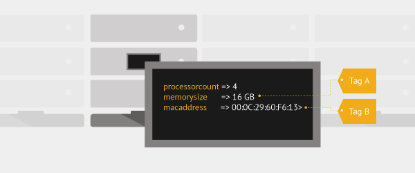
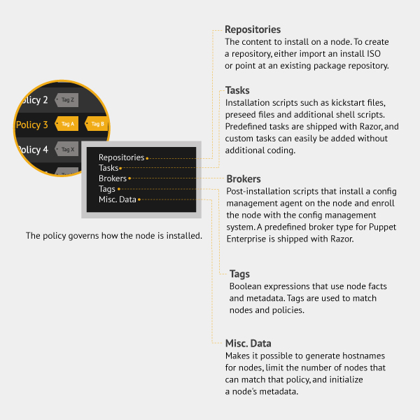

# How Razor works

There are five key steps for provisioning nodes with Razor.

When a new node appears, Razor discovers its characteristics by booting it with the Razor microkernel and using Facter to inventory its facts.

The node is tagged based on its characteristics. Tags contain a match condition — a Boolean expression that has access to the node’s facts and determines whether the tag should be applied to the node or not.

Node tags are compared to tags in the policy table. The first policy with tags that match the node’s tags is applied to the node.

The node is now installed. If you choose, you can hand off management of the node to Puppet Enterprise.

## Razor system requirements

The Razor server and client are supported on these operating systems.

|Component|Supported OS|
|---------|------------|
|Server|-   RHEL 6 and 7

-   CentOS 6 and 7

|
|Client|-   Windows 2008 R2 Server
-   Windows 2012 R2 Server
-   Windows 2016 Server
-   ESXi 5.5
-   RHEL 6 and 7
-   CentOS 6 and 7
-   Ubuntu 14.04
-   Debian Wheezy

|

## Pre-requisites for machines provisioned with Razor

To successfully install an operating system on a machine using Razor, the machine must meet these specifications.

-   Have at least 512MB RAM.

-   Be supported by the operating system you're installing.

-   Be able to successfully boot into the microkernel. The microkernel is based on [CentOS 7](https://wiki.centos.org/Manuals/ReleaseNotes/CentOS7), 64-bit only, and supports the [x86-64 Intel architecture](https://en.wikipedia.org/wiki/X86-64).

-   Be able to successfully boot the [iPXE](http://ipxe.org/) firmware.

