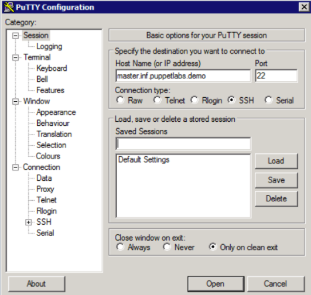
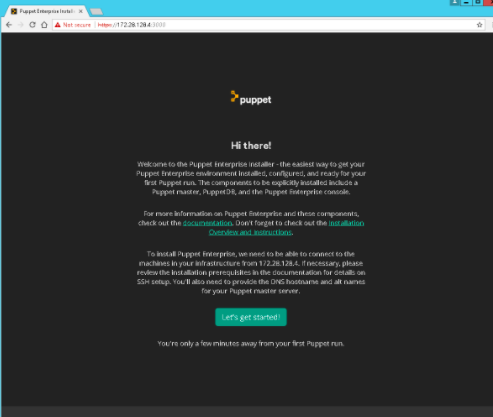

# Start installing PE in a Windows environment

This getting started guide uses a web-based installer to walk you through a basic Puppet Enterprise \(PE\) installation, ideal for trying out PE with up to 10 nodes, or for managing up to 4000 nodes.

**Important:** The Puppet master can run only on \*nix machines, but Windows machines can run as Puppet agents and you can manage those nodes with your \*nix Puppet master**.** This getting started guide assumes you want to access the master \*nix machine remotely from a Windows machine. If you plan to install directly onto a \*nix node, follow the [installing PE instructions in the \*nix getting started guide](https://puppet.com/docs/pe/2017.3/quick_start_guides/install_pe_getting_started.html).

On a single \*nix machine, you install:

-   The Puppet master, the central hub of activity, where Puppet code is compiled to create agent catalogs, and where SSL certificates are verified and signed.
-   The console, PE's web interface, which features numerous configuration and reporting tools.
-   PuppetDB, which collects data generated throughout your Puppet infrastructure.

## Step 1: Review installation prerequisites on your Linux server

Before getting started, review this checklist to make sure you're ready to install PE.

### About this task

**Note:** The examples in this guide use a Linux server running Red Hat Enterprise Linux \(RHEL\) 6.

### Procedure

1.  Be aware that you must work as the `root` user on the command line throughout the installation process.

2.  Make sure you meet the [hardware recommendations](https://puppet.com/docs/pe/2017.3/installing/hardware_requirements.html#hardware-requirements) for 10 or fewer nodes.

    You can download and install Puppet Enterprise on up to 10 nodes at no charge.

3.  Make sure that DNS is properly configured on the server you're installing on.

    -   All nodes must know their own hostnames, which you can achieve by properly configuring reverse DNS on your local DNS server, or by setting the hostname explicitly. Setting the hostname usually involves the `hostname` command and one or more configuration files, but the exact method varies by platform.

    -   All nodes must be able to reach each other by name, which you can achieve with a local DNS server.

4.  Know the fully qualified domain name \(FQDN\) of the server you're installing PE on, for example, `master.example.com`.

5.  The web-based installer requires access to port 3000 on the server you're running the installer from.


**Related information**  


[Hardware requirements](hardware_requirements.md#)

## Step 2: Prepare your Windows System

Some extra software is necessary so that you can communicate and work between your Windows and Linux machines.

### About this task

On your Windows machine:

### Procedure

1.  Set up an SFTP client. Popular clients include FileZilla and WinSCP. The examples below use WinSCP.

2.  Set up an SSH Client. The examples below use the Putty SSH client.


## Step 3: Install the master on your Linux machine

These steps show you how to use a Windows machine to install a Puppet master on a Linux server.

### About this task

### Procedure

1.  Open the SSH client, and enter the IP address and port of the Linux machine that you want to use as your master. You can then open an SSH session to the master.

    

2.  When prompted in the terminal, log into the Linux node as the `root` user.

3.  Download the PE installer to the server that you intend to use as your master by copying the appropriate download URL from the [downloads page](https://puppet.com/download-puppet-enterprise?_ga=2.195400108.1038057021.1505707881-652786455.1484937422) and running:

    ```
    wget --content-disposition '<DOWNLOAD_URL>'
    ```

4.  The web-based installer requires access to port 3000 on the node you're running the installer from. If you can't connect directly to port 3000, you can port forward — or "tunnel" — to the installer using SSH.

    1.  Open PuTTY. Select **Sessions** and in the **Host Name** field, enter the FQDN of the host you want to run the installer from.

    2.  Select **Tunnels** and in the **Source Port** field, enter 3000.

    3.  In the **Destination** field, enter localhost:3000.

    4.  Select **Local**, click **Add**, and then click **Open**.

5.  Run the following command to unpack the tarball:

    ```
       tar -xf <TARBALL> 
    ```

    **Note:** You need about 1 GB of space in ``/tmp`` to untar the installer.

6.  Change directories to the installer directory, and run the installer:

    ```
    sudo ./puppet-enterprise-installer
    ```

7.  When prompted, choose the guided installation option.

    The installer starts a web server and provides an installer URL.

    The default installer URL is `https://<INSTALL_PLATFORM_HOSTNAME>:3000`. If you forwarded ports in step 1, the URL is `https://localhost:3000`.

    Copy this address into your browser \(make sure to use `https`\).

8.  In a browser, access the installer URL and accept the security request.

    The installer uses a default SSL certificate. You must add a security exception in order to access the installer.

    **Important:** Leave your terminal connection open until the installation is complete or else installation fails.

9.  On the installer page, click **Let's get started**.

    


### Results

**Note:** From this point the examples refer to your Linux server as the master.

**Related information**  


[Accepting the console's certificate](console_accessing.md#)

## Step 4: Personalize your installation

The installer collects key configuration information, which is used to make sure your installation is set up correctly. Follow the prompts to configure your installation:

### Procedure

1.  Choose **Install on this server**, which installs the Puppet master component on the Linux server.

2.  Provide the following information about the Puppet master server:

    -   Puppet master FQDN: The fully qualified domain name of the server you're installing PE on.

    -   DNS aliases: A comma-separated list of [DNS alt names](https://puppet.com/docs/puppet/5.3/configuration.html#dnsaltnames) or aliases that your agent nodes \(the nodes you wish to manage with PE\) can use to reach the Puppet master.

3.  When prompted about database support, choose the default option, **Install PostgreSQL for me**.

4.  Create a password for the console administrator. The password must be at least eight characters. The user name for the console administrator is always `admin`.

5.  Click **Submit**, and then review the information you provided. If you need to make any changes, click **Go back** and make whatever changes are required. Otherwise, click **Continue**.


## Log into the PE console

On the validation page, the installer verifies various configuration elements \(for example, if SSH credentials are correct, if there is enough disk space, and if the operating system is the same for the various components\).

### About this task

### Procedure

1.  When you click **Start using Puppet Enterprise**, you receive a browser warning about an untrusted certificate. This is because you were the signing authority for the console's certificate, and your Puppet Enterprise deployment is not known to your browser as a valid signing authority. Ignore the warning and accept the certificate.

2.  On the login page for the console, log in with the username `admin` and the password you created when installing the Puppet master.


### Results

Congratulations, you've successfully installed the Puppet master node! Next install PE on your agent nodes, so that you can manage these nodes with Puppet.

